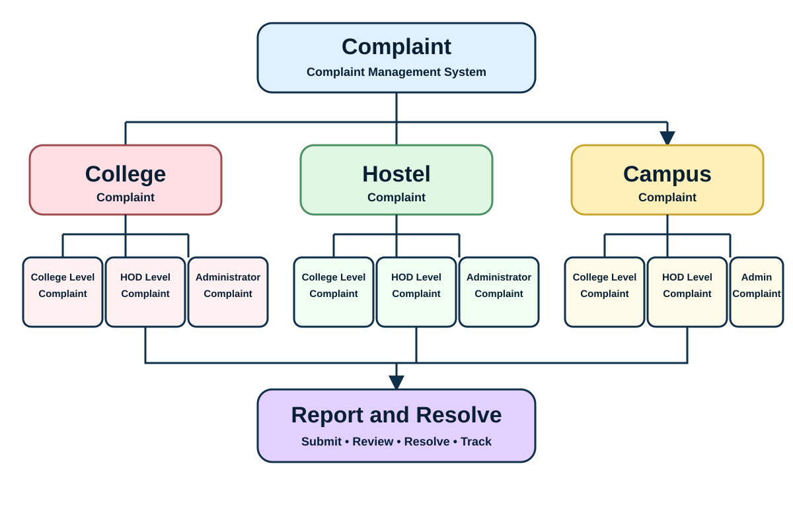

# Complaint Management Page

This report documents the new Complaint Management page added to the website.

## Source flowchart

## Website flow

1. Complaint Management is the entry point.
2. A user chooses one of three categories:
   - College Complaint
   - Hostel Complaint
   - Campus Complaint
3. Each category exposes:
   - College Level Complaint
   - HOD Level Complaint
   - Administrator Level Complaint
4. Selecting a level opens a complaint submission interface.
5. The final workflow is represented by **Report and Resolve**.

## Implementation

- Separate page: `/complaints.html`
- React entry: `src/complaints.jsx`
- Page component: `src/pages/ComplaintManagement/ComplaintManagement.jsx`
- Page styling: `src/pages/ComplaintManagement/ComplaintManagement.css`
- The page is responsive for desktop, tablet and mobile.
- Supporting documentation and the flowchart asset are stored in this `report/` folder.

## Backend note

The submission form is currently a frontend demo. Connect it to the project's backend/API when complaint persistence, authentication, status tracking and administrator workflows are available.
